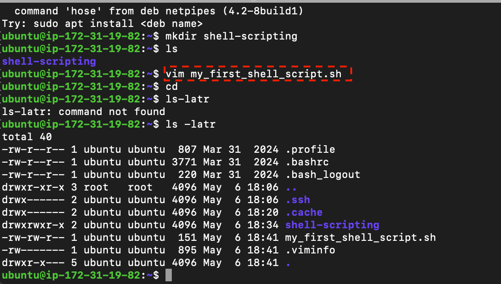
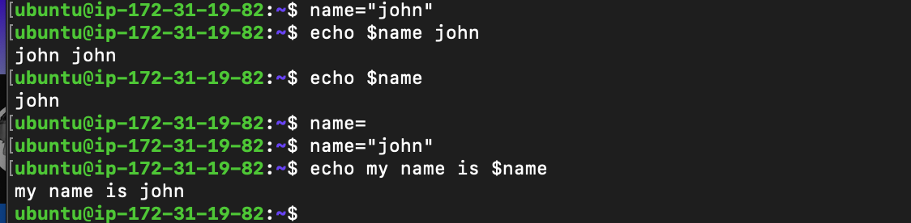

># SHELL SCRIPTING

With the thousands of commands available to the command line user, how can we remember them all? The answer is, we don't. The real power of the computer is its ability to do the work to us. To get it to do that, we use the power of the shell to automate things. We write shell scripts. 
> What is Shell Scripting 

Imagine you're tasked with setting up new workstations and user accounts regularly at your jot Instead of manually creating each folder and user account, a simple shell script serves as your efficient digital helper. By automating the creation of multiple directories and user accounts wi. just a few lines of code, it saves you considerable time and effort, allowing you to concentrate on more critical aspects of your work. 
Shell scripting is the process of writing and executing a series of instructions in a shell to automate tasks. A shell script is essentially a script or program written in a shell language, such as Bash, sh, zsh, or PowerShell ? 

Task for you: 
1. Create a folder on an ubuntu server and name it shell-scripting 

2. Using the vim editor, create a file called my first shell script.sh 

3. Put the shell script code above into the new file

 4. Save the file 
 5. use cd command to change into the shell-scripting directory 
 6. Use ' is -lat r ' command to confirm that the file is indeed created. 
 

> ./my_first_shell_script.sh

 Notice that we now have a Permission denied error which can easily be resolved by giving the file the necessary permission it requires. 
But, did you also notice the mention of "bash" at the beginning of the error message? It indicates that the error message is coming from the Bash shell itself. Bash is the command interpreter or shell that you're using in the terminal to execute commands. We will talk more about this in the next section. 
Task for you: 
1. Add the execute permission for the ' owner' to be able to execute the shell script 

2. Run the shell script.

3. Evaluate and ensure that 
3 folders are created

 4. Evaluate and ensure that 3 users are created on the linux server 
 

 Now that the variable is assigned, you may ask, how then can i use it? 
Retrieving value from a variable 
After assigning a value to a variable, as shown in the previous example where we assigned "John" to the variable name, you can utilize this variable in various ways in your script or program. One of the most straightforward methods to use or retrieve the value stored in a 
variable is by echoing it back to the console. This is done using the echo command in shell 
scripting. 
echo $name 
This command instructs the shell to print the value of name to your screen, which, in our case, would output John 

